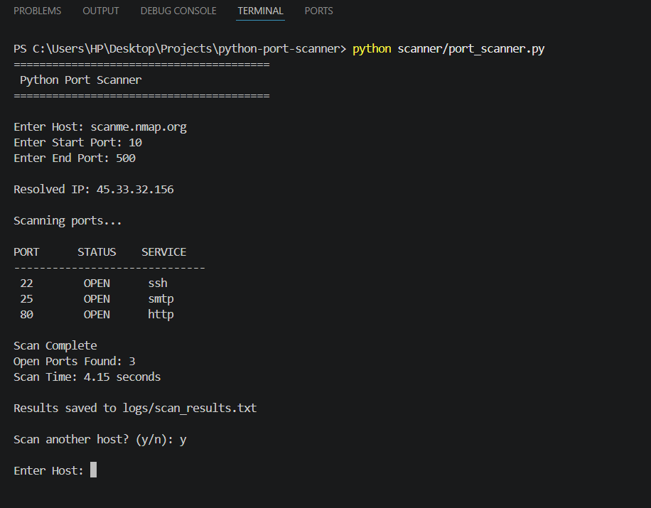
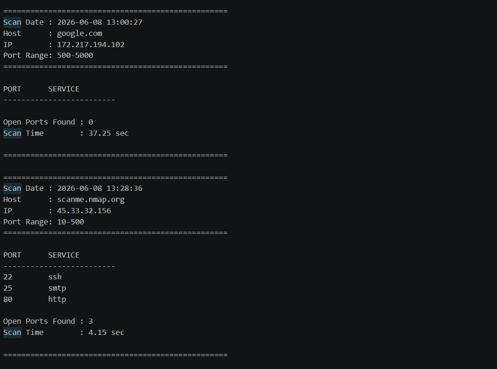
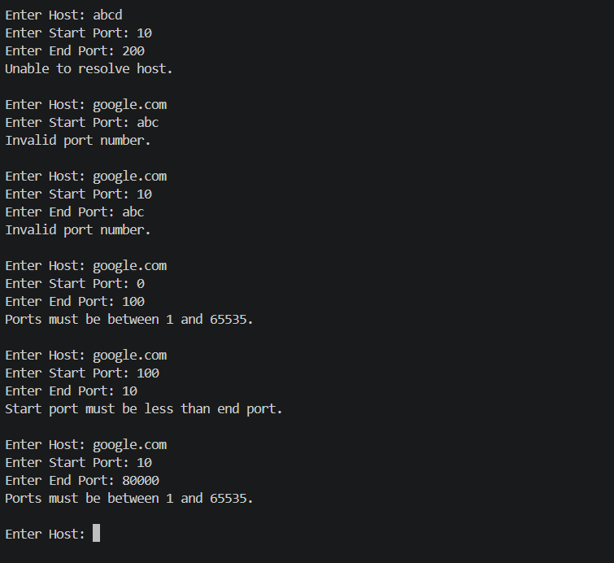

# Multi-Threaded Python Port Scanner

A multi-threaded TCP port scanner developed using Python socket programming and concurrent scanning techniques.

The application performs host resolution, port scanning, service detection, result logging, and scan reporting. It supports custom port ranges, concurrent scanning, continuous operation, and detailed scan statistics.

## Project Objective

The objective of this project is to demonstrate practical networking and cybersecurity concepts through the development of a multi-threaded TCP port scanner capable of performing host discovery, service identification, and scan result logging.

## Features

- Host Resolution (Domain → IP)
- TCP Port Scanning
- Service Detection
- Multi-Threaded Scanning
- Custom Port Range Support
- Continuous Scanning Mode
- Scan Result Logging
- Timestamp Tracking
- Scan Statistics
- Input Validation
- Error Handling

## Key Capabilities

- Resolves domain names into IP addresses
- Detects open TCP ports on remote hosts
- Identifies common services running on open ports
- Supports concurrent scanning using multiple threads
- Generates detailed scan reports with timestamps
- Handles invalid user inputs and host resolution errors

## Technologies Used

- Python
- Socket Programming
- TCP/IP Networking
- Concurrent Programming
- Multithreading
- File Handling

## Project Structure

```text
python-port-scanner/
│
├── scanner/
│   └── port_scanner.py
│
├── logs/
│   └── scan_results.txt
│
├── docs/
│   └── screenshots/
│
├── README.md
└── requirements.txt
```

## How to Run

### Clone Repository

```bash
git clone https://github.com/Jithendra-ayesh/python-port-scanner.git
```

### Navigate to Project

```bash
cd python-port-scanner
```

### Run Scanner

```bash
python scanner/port_scanner.py
```

## Example Usage

```text
========================================
 Python Port Scanner 
========================================

Enter Host: scanme.nmap.org
Enter Start Port: 10
Enter End Port: 100

Resolved IP: 45.33.32.156

Scanning ports...

PORT      STATUS    SERVICE
------------------------------
 22        OPEN      ssh
 25        OPEN      smtp
 80        OPEN      http

Scan Complete
Open Ports Found: 3
Scan Time: 0.86 seconds

Results saved to logs/scan_results.txt

Scan another host? (y/n): y
```

## Screenshots

### Scanner Execution



### Log File



### Invalid Input Handling



## Learning Outcomes

Through this project I gained practical experience with:

- TCP Socket Programming
- Port Scanning Techniques
- Network Reconnaissance Concepts
- Concurrent Programming
- ThreadPoolExecutor
- Logging and Monitoring
- Error Handling
- Network Security Fundamentals

## Future Improvements

- Banner Grabbing
- Export Results to CSV
- UDP Port Scanning
- GUI Version
- Custom Scan Profiles
- Service Version Detection